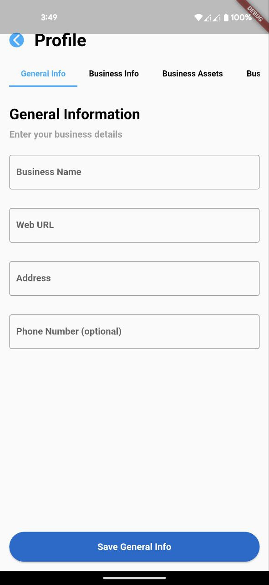
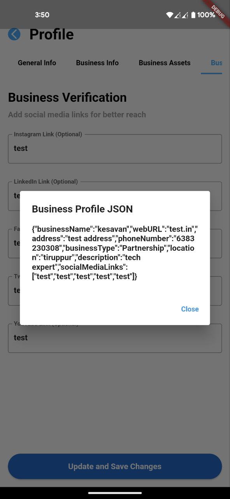

[](https://opensource.org/licenses/MIT)

## Overview

Simple App That Uses segmented screen and image picker and conver user input into json

## Screenshots







## Installation

```shell
# Clone the repository
git clone https://github.com/Kesavan-Hex/Swazei-Task.git

# Navigate to the project directory

# Install dependencies
flutter pub get

# Run the app
flutter run
